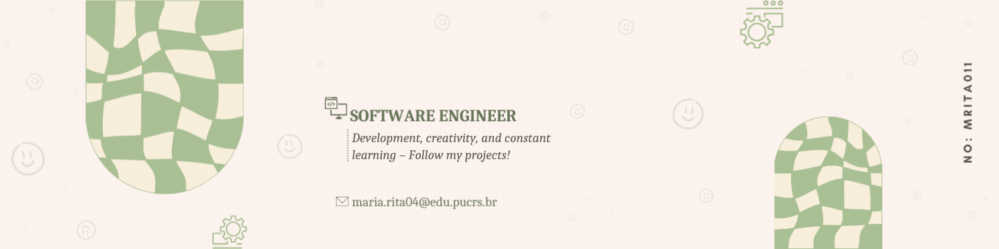

# Hi there!! 🧡

  

</img>

##

Hello! My name is Maria Rita, and I’m 20 years old. I'm currently studying Software Engineering at the Polytechnic School of the Pontifícia Universidade Católica do Rio Grande do Sul (PUCRS).  
  
My passion for technology began in high school, where I had the opportunity to take a technical course in computer science at IFRS. It was through this experience, enriched by teaching, extension, and innovation projects, where I was a scholarship holder, that I discovered my deep connection to the field and its boundless possibilities.  

Today, my ambition is to become a full-stack developer, fully immersing myself in the endless opportunities that technology provides. But my dream goes beyond that: in the long term, I aspire to be a catalyst for change, inspiring and supporting girls and women to pursue careers in technology. Just as the women I encountered on my journey inspired and supported me, I aim to reciprocate by doing the same for others.

   
  

  

#

<h1>📙: Learning</h1>

  
  
  
  
  
  
  

